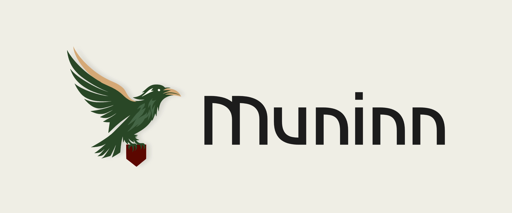
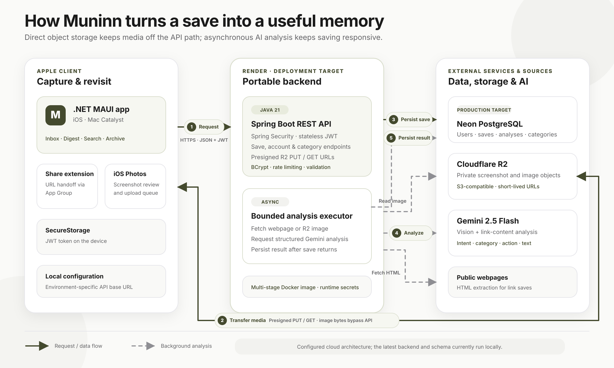

# Muninn

> Your memory, returned — turn forgotten screenshots and links into organized, actionable reminders.



[](https://dotnet.microsoft.com/apps/maui)
[](https://spring.io/projects/spring-boot)
[](https://openjdk.org/)
[](https://github.com/claycasani/Muninn/actions/workflows/backend-ci.yml)

## What it is

Muninn is a .NET MAUI app for iOS and Mac Catalyst that saves screenshots and links, asks Gemini to infer *why* each item mattered, and organizes the result into an actionable inbox. I built it to solve a personal problem: useful things disappeared into my camera roll and browser history faster than I could return to them.

The product loop is simple: capture something, let the analysis happen in the background, revisit it in the Inbox or Digest, then complete or archive it when it is no longer pending.

## Status

Cloud deployment is production-shaped but not currently live. The repository includes a Dockerized **Render** service definition and environment-driven configuration for an external **Neon PostgreSQL** database. A previous backend revision was exercised on Render; the latest backend and schema currently run locally. Cloudflare R2 stores image objects, while PostgreSQL stores save records, object keys, and analysis metadata.

The core link and image analysis paths are implemented. The iOS screenshot-review workflow and Liquid Glass-inspired chrome are active development areas; see [Known limitations](#known-limitations-and-roadmap) for the device-memory and verification caveats.

## Product tour

<p align="center">
  <a href="docs/assets/01%20%E2%80%94%20Inbox.jpg">
    
  </a>
  <a href="docs/assets/02%20%E2%80%94%20Screenshot%20Review.jpg">
    
  </a>
</p>

<p align="center">
  <a href="docs/assets/03%20%E2%80%94%20AI%20Save%20Detail.jpg">
    
  </a>
  <a href="docs/assets/04%20%E2%80%94%20Digest.jpg">
    
  </a>
</p>

<p align="center">
  <a href="docs/assets/05%20%E2%80%94%20Search%20and%20Archive.jpg">
    
  </a>
</p>

## Architecture



Muninn uses one client codebase and a portable, containerized API:

1. The **.NET MAUI client** captures a pasted/shared URL or an image. Its iOS Photos integration discovers screenshots taken after the user grants access and presents a Save/Ignore review queue.
2. **Spring Security** authenticates requests with stateless JWTs. Spring Data JPA owns persistence, and **Flyway** applies the versioned PostgreSQL schema before Hibernate validates it.
3. For images, the API issues a 15-minute **presigned R2 PUT URL**. The client uploads directly to Cloudflare R2, so image bytes do not pass through the API request path.
4. Save creation returns immediately. A bounded in-process Spring executor fetches link content or image bytes and calls **Gemini 2.5 Flash** for a structured title, inferred intent, category, suggested action, and extracted text.
5. The backend persists the analysis and returns short-lived presigned R2 GET URLs when image saves are read.

| Layer | Verified implementation |
|---|---|
| Client | C# · .NET 10 MAUI · iOS · Mac Catalyst · CommunityToolkit.Mvvm |
| Native iOS | Photos framework · UIKit share extension · App Group handoff |
| API | Java 21 · Spring Boot 4.1 · Spring Web MVC · Spring Security |
| Data | PostgreSQL · Spring Data JPA · 7 Flyway migrations |
| AI | Gemini 2.5 Flash via `google-genai`; separate link and vision prompts |
| Storage | Cloudflare R2 through the AWS SDK's S3-compatible client and presigner |
| Cloud | Multi-stage Docker image · Render Blueprint · external Neon PostgreSQL configuration |
| Delivery | GitHub Actions runs the backend test suite on backend changes |

## Key features

- **AI intent inference** — analyzes webpage content and screenshots into a concise artifact title, inferred reason, suggested next action, extracted text, and category.
- **User-controlled categorization** — seeds per-user categories, lets users add/rename/delete them, and constrains future AI classification to that vocabulary.
- **Link capture** — supports paste-to-save and an iOS URL share extension with retry-safe App Group handoff to the authenticated main app.
- **Screenshot review** — detects new iOS screenshots after a local baseline, shows a badge and review queue, and reuses the direct-to-R2 image pipeline. The workflow is implemented but still needs further large-backlog memory work and device soak testing.
- **Search and filtering** — searches titles, domains, inferred intent, extracted text, and categories across Inbox and Archive; results apply when the user commits the query to avoid an iOS CollectionView focus regression.
- **Digest view** — resurfaces active saves newest-first in-app. Scheduled daily selection and push/local notifications are not implemented yet.
- **Lifecycle and account controls** — complete, archive, restore, permanently delete (including the R2 object), edit account settings, change password, and delete the account.

## Engineering highlights

- **Custom authentication:** Spring Security filter chain, 24-hour HMAC-signed JWTs, client-side expiry checks, MAUI `SecureStorage` as the primary token store, and coordinated mid-session `401` recovery.
- **Security hardening:** BCrypt cost factor 12; eight login/register attempts per minute per endpoint, keyed by the first forwarded client IP with a remote-address fallback; stateless sessions; CSRF/CORS disabled for the native-client API; generic production error bodies; JWT startup failure when the signing secret is missing or under 32 characters.
- **Injection-resistant persistence:** application data access uses Spring Data repository methods and named JPQL parameters rather than SQL assembled from user input. Test-only `JdbcTemplate` calls use placeholders.
- **Non-blocking analysis:** save requests persist first and dispatch Gemini work to a bounded executor. Provider code sits behind `AnalysisService`, keeping controllers and save logic independent of the model SDK.
- **Direct object-storage path:** authenticated users receive scoped, expiring R2 upload URLs; the client uploads without proxying bytes through Spring Boot, while reads use short-lived presigned URLs.
- **Native integration:** the URL share extension handles App Group coordination and retry semantics; the Photos service handles authorization, screenshot-only predicates, baselines, reviewed state, and foreground badge refreshes.
- **Production portability:** a multi-stage Java 21 Docker build produces a minimal runtime image; Render injects database, JWT, Gemini, and R2 configuration at runtime.
- **Evidence-driven debugging:** a physical-device jetsam investigation isolated multi-gigabyte image decodes to SVGs exported without absolute dimensions, then added bounded assets and screenshot-fetch safeguards. The concise investigation is recorded in [DEVLOG.md](DEVLOG.md).

## Known limitations and roadmap

- **Screenshot memory:** screenshot counting is lazy and does not decode images, and thumbnails are bounded to 1024px. The review page still eagerly loads every pending thumbnail, while save/preview paths materialize a full image in memory. Paging, cancellation, and large-backlog physical-device profiling remain open.
- **Glass chrome:** current buttons and the floating tab bar use Syncfusion `SfGlassEffectView` with a runtime plain-`Border` kill-switch. This is not a direct native `UIGlassEffect` implementation. Recent interaction and layout refinements still have device-verification items outstanding.
- **Share extension distribution:** the URL handoff is simulator-verified. Physical-device/App Store builds still require properly provisioned App Group entitlements for both targets; personal-team test builds intentionally omit the extension.
- **Digest delivery:** the current Digest is an in-app view over active saves. There is no digest history table in the implemented schema, scheduled selection job, APNs integration, or local-notification scheduler.
- **Async durability:** analysis runs in an in-process executor, not a durable external queue. A process restart can interrupt an in-flight analysis.
- **Proxy and token-storage hardening:** the rate limiter consumes the first `X-Forwarded-For` value without an explicit trusted-proxy allowlist, and the client falls back to MAUI `Preferences` if `SecureStorage` is unavailable. Both paths should be tightened before a higher-risk production launch.
- **Platform parity:** Photos ingestion and the share extension are iOS-specific; Mac Catalyst does not yet have equivalent screenshot-folder ingestion or a share target.
- **Release configuration:** local and physical-device development endpoints are implemented. A public client build still needs an explicit production API-base-URL configuration and final distribution signing.

## Tech stack

| Area | Technologies |
|---|---|
| Languages | C# · Java · SQL · XAML |
| Apple client | .NET MAUI 10 · CommunityToolkit.Mvvm · Syncfusion.Maui.Core · UIKit · Photos |
| Backend | Java 21 · Spring Boot 4.1 · Spring Security · Spring Data JPA · Bean Validation |
| AI and extraction | Gemini 2.5 Flash · Google GenAI Java SDK · jsoup |
| Database | PostgreSQL 16 locally · Neon PostgreSQL deployment target · Flyway |
| Object storage | Cloudflare R2 · AWS SDK for Java 2.x |
| Cloud and CI | Docker · Render · GitHub Actions |
| Testing | Spring Boot integration tests · Spring Security Test · Awaitility |

## Source availability and copyright

Copyright © 2026 Clay Casani. All rights reserved.

This repository is public solely for portfolio review. It is **not open source**. Except for the rights GitHub requires to display and fork a public repository under its Terms of Service, no permission is granted to use, copy, modify, publish, distribute, sublicense, sell, deploy, or create derivative works from this code. Contact the author for permission beyond portfolio evaluation.

`Syncfusion.Maui.Core` is proprietary third-party software governed by Syncfusion's own license terms. No Syncfusion binaries or license key are included here. Anyone building the project must obtain their own valid Syncfusion license and key directly from Syncfusion.

## Running locally

### Prerequisites

- JDK 21 and Maven
- Docker Desktop (for local PostgreSQL)
- .NET 10 SDK with the MAUI workload
- Xcode 26+ for iOS/Mac Catalyst builds
- Gemini and Cloudflare R2 credentials, plus a separately obtained valid Syncfusion license/key, for the complete image/glass experience

### Backend

Copy the documented template and replace placeholders only in the ignored local file:

```bash
cp .env.example backend/.env
docker compose up -d db
cd backend
mvn spring-boot:run
```

Required values are documented in [.env.example](.env.example): a 32+ character `JWT_SECRET`, `GEMINI_API_KEY`, local PostgreSQL settings, and R2 credentials. Production-only Render/Neon variables are also shown there but should not be used for the local Docker database.

Run the backend checks with:

```bash
cd backend
mvn test
```

### App

Create the ignored embedded config from the public template, then add a local Syncfusion key and development API URL:

```bash
cp app/appsettings.template.json app/appsettings.json
dotnet build -f net10.0-ios -p:RuntimeIdentifier=iossimulator-arm64 app/Muninn.csproj
```

For Mac Catalyst:

```bash
dotnet build -f net10.0-maccatalyst app/Muninn.csproj
```

Never commit `backend/.env`, `app/appsettings.json`, signing identities, or generated build output.

## Repository layout

```text
.
├── app/                 .NET MAUI client
├── app.shareextension/  iOS URL share extension
├── backend/             Spring Boot API and Flyway migrations
├── .github/workflows/   Backend CI
├── docker-compose.yml   Local PostgreSQL
├── render.yaml          Render service blueprint
└── DEVLOG.md            Curated engineering journey
```
